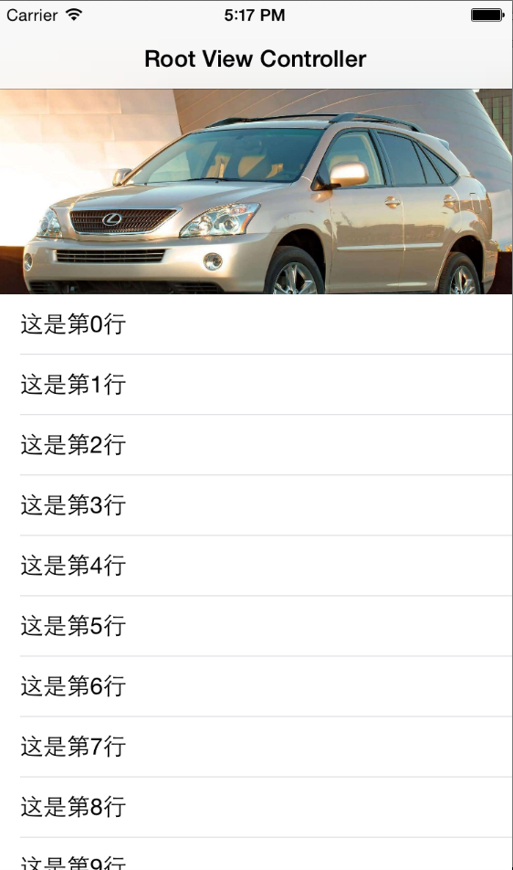

#CorePullScale
####表格顶部图片下拉放大控件，`一键式安装`，异常简单！

   

##框架特性（持续关注[信息公告牌](https://github.com/CharlinFeng/Show)）： 
>1.支持所有ios版本（ios6-ios8），没有版本压力！ 
>2.支持大屏的横竖屏，不再担心横屏变形了。 
>3.支持TableView 及 CollectionView 。 
>4.自动管理屏幕旋转，无需手动管理。 

 
##安装说明： 
>1.将CorePullScale文件夹放入您的项目中 
>2.#import "UIScrollView+PullScale.h" 
>3.在ViewdidLoad中直接按以下代码安装即可（图片名换成您对应的图片名） 

    [self.tableView addPullScaleFuncInVC:self imgName:@"car@2x.jpg" originalHeight:150 hasNavBar:(self.navigationController!=nil)];
  
 
##看看效果图吧

  

 

-----
    CorePullScale 表格顶部图片下拉放大控件，`一键式安装`，异常简单！   感谢您的关注！ 
-----

  

